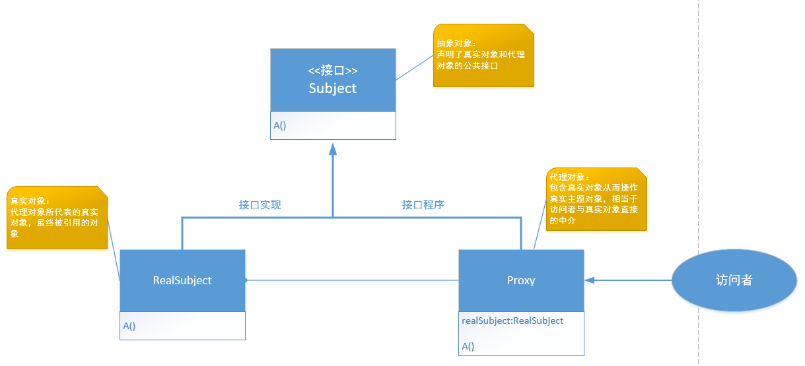
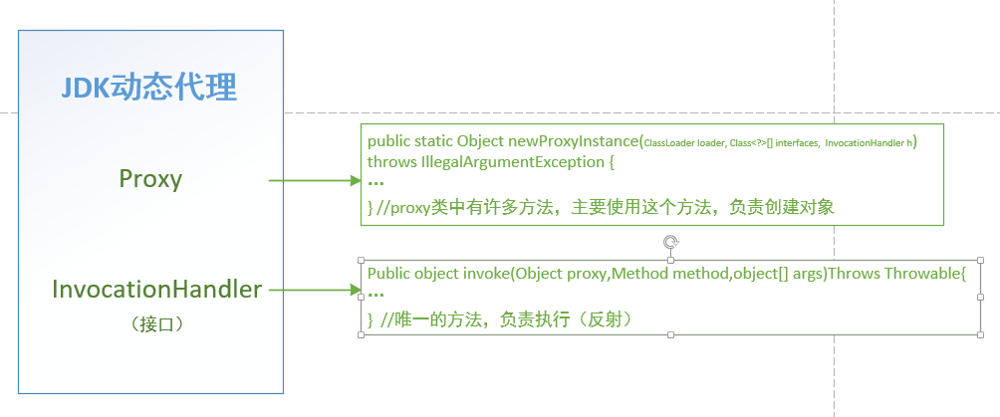

### 动态代理
#### 代理
###### 定义：
给目标对象提供一个代理对象，并由代理对象控制对目标对象的引用。
###### 目的：
1. 通过引入代理对象的方式来间接访问目标对象，访问直接访问目标对象给系统带来的不必要的复杂性
2. 通过代理对象对原有的业务增强     

下图展示了代理类图：        
   
将代理看做代购，我们要买某样东西这个过程就是抽象对象的某个方法，那么本来要去买的具体的东西就是真实对象的那个相应的方法。
#### 静态代理
由程序员创建或特定工具自动生成源代码，也就是在编译时就已经将接口，被代理类，代理类等确定下来。在程序运行之前，代理类的.class文件就已经生成。
###### 简单实现
首先创建接口：

```
public interface Subject{
    void A();
}
```
真实对象实现接口，真实对象可以具体A()的内容：

```
public class realsubject implements Subject{
    public void A(){
        System.out.println("A()");
    }
}
```
同时代理类也需要去实现接口，同时包含了上述的真实对象，代理本身不会有需要完成的功能，他只会搬运真实对象的具体方法，不过在搬运前后，他可以有自己其他的功能，就像代购，在买到东西后，会给东西加一个精美的包装，那么这里就可以看做是后置增强。

```
public class proxy implements Subject{
    public realsubject rs；
    public void A(){
        dosomethingbefore();//前置增强
        rs.A();
        dosomethingend();//后置增强
    }
}
```

###### 缺点
开放-封闭原则：面向对象的编程语言的程序对外扩展开放，对修改关闭；当需求发生变化时，我们可以通过添加新模块来满足新需求，而不是通过修改原来的实现代码来满足新需求。    
静态代理的缺点主要就是违背了开放-封闭原则。拓展能力差、可维护性差。
#### 动态代理
代理类在程序运行时创建的代理方式被称为动态代理。动态代理的代理类并非在java代码中定义，而是在运行时根据我们在java代码中的指示动态生成的。    
下图展示了动态代理中关键两个内容：  
 
###### 特点
- 动态代理类：在程序运行时，通过反射机制动态生成
- 动态代理类通常代理接口下的所有类
- 动态代理实现不知道要代理的是什么，只有在运行时才能确定
- 动态代理的调用处理程序必须实现InvocationHandler接口，及使用Proxy类中的newProxyInstance方法动态的创建代理类
- Java动态代理只能代理接口，要代理类需要使用第三方的CLIGB等类库

##### 两种动态代理
###### 基于JDK的动态代理
首先创建一个自己的类实现InvocationHandler接口，以及使用Proxy类中的newProxyInstance方法动态的创建代理类

```
public class own implements InvocationHandler{
    private object rs;//被代理的对象
    public void A(Object thing)
    public object getproxyInstance(){
        return Proxy.newproxyInstance(rs.getClass().getClassLoader(),re.getClass().getInterface(),this);
    }//通过Proxy获取动态代理的对象
    Public object invoke(Object proxy,Method method,object[] args)Throws Throwable{
        dosomethingbefore();
        Object ref = method.invoke(rs,args);
        dosomethingend();
        return ref;
    }//通过动态代理对象对方法进行增强
}
```
然后使用上述的类，完成动态代理
```
public class Use{
    public static void main(String[] args){
        realsubjct1 rs1=new realsubject1();//真实对象1
        realsubject1 rs2=new realsubject2();//真实对象2
        own owner=new own();//创建代理
        own.A(a)//真实对象1需要使用a
        realsubjct1 lei1=(realsubjct1)own.getProxyInstance();//开始为真实对象1代理
        
        own.A(b)//真实对象2需要使用b
        realsubjct2 lei2=(realsubjct2)own.getProxyInstance();//开始为真实对象2代理
    }
}
```
动态代理真正自己编程中很少去手写，但是用的比较多。例如在Spring的AOP中用的比较多。
###### 基于CGILB的动态代理
由于JDK的动态代理一定要继承一个接口，而大部分情况是基于POJO类的动态代理，可以选择使用基于CGILB的动态代理     
1.首先引入CGLIB的jar包    
2.然后创建代理类
```
public class CGsubject {
    public void sayHello(){
        System.out.println("hello world");
    }
}
```
3.实现MethodInterceptor接口，对方法进行拦截
```
public class HelloInterceptor implements MethodInterceptor{
    @Override
    public Object intercept(Object o, Method method, Object[] objects, MethodProxy methodProxy) throws Throwable {
        System.out.println("begin time -----> "+ System.currentTimeMillis());
        Object o1 = methodProxy.invokeSuper(o, objects);
        System.out.println("end time -----> "+ System.currentTimeMillis());
        return o1;
    }
}
```
methodProxy为代理方法，invokeSuper为调用被拦截的方法   

4.创建被代理的类，使用动态代理
```
public class Main {

    public static void main(String[] args) {
        Enhancer enhancer = new Enhancer();
        enhancer.setSuperclass(CGsubject.class);
        enhancer.setCallback(new HelloInterceptor());
        CGsubject cGsubject = (CGsubject) enhancer.create();
        cGsubject.sayHello();
    }
}
```
通过Enhancer来生成被代理类，这样可以拦截方法，对方法进行前置和后置增强。
