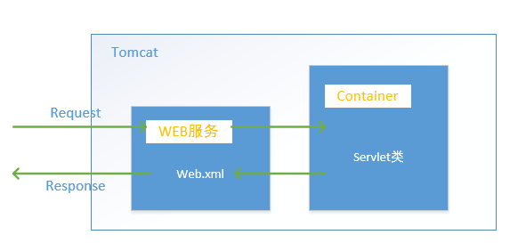

# 目录
### 反射
#### 定义
Java的反射（reflection）机制，是指在程序的运行状态中：    
- 对于任何一个类，都能够知道这个类的所有属性和方法；  
- 对于任何一个对象，都能够调用他的任意一个方法和属性；   

#### 反射入口
编写java文件后，通过javac命令生成.class字节码文件对象，计算机最终运行的就是这个字节码文件对象。有三种获取字节码文件对象的方法：  
- object的getclass方法
- 类型.class属性
- （常用）class.forname("类的路径（配置文件）") 

来看一下在编写java过程中，类与字节码文件对象的对应：    

        类 | 字节码文件对象
        ---|---
        构造方法 | 构造方法对象（constructor）
        成员变量| 成员变量对象（Field）
        成员方法| 成员方法对象（Method）

反射就是通过获取上述的对象，来完成一系列的工作。   
首先通过上述的三种方法的其中一种获取需要的方法或属性对应字节码文件对象，然后通过getconstructors获取构造对象，之后使用getmethod，getfield获取成员的方法和变量。最后通过method.invoke(对象，参数)使用对应的成员的方法。     

**== 上述的getXXX只能获取public属性的对应值，要获取所有的，则需要使用getDeclaredXXX。这样就可以获取所有的属性的对应信息。还有就是就算可以get所有的这些属性，但如果要访问的话，需使用setACCESSIABLE(True)来暴力访问。==**

---
### servlet
#### 定义
servlet，是java编写的服务器端程序。其主要功能在交互式地浏览和修改数据，生成动态的Web内容。狭义的Servlet是指java语言实现的一个接口。更多的广义的Servlet是指任何实现了这个servlet接口的类。      
Servlet运行与支持java的应用服务器中，从实现上讲，Servlet可以响应任何类型的请求，但绝大多数情况下Servlet只用来扩展基于HTTP协议的web服务器。
##### 工作模式
- 客户端发送请求至服务器
- 服务器启动并调用Servlet，Servlet根据客户端请求生成响应内容并将其传给服务器
- 服务器将响应返回客户端    

下图以Tomcat为例展示了servlet的工作流程：  
   
##### Servlet的生命周期
1. init()——出生，当servlet第一次被请求时，servlet容器会调用这个方法初始化一个servlet对象出来
2. service()——工作，每当请求servlet时，servlet容器就会调用这个方法。就像员工，需要不停的接收老板的指令并工作一样。
3. destory()——死亡，当要销毁servlet时，servlet容器就会调用这个方法。一般在这个方法中会写一些清除代码的功能。
4. servlet的其他两个方法：
    -    getServletInfo()，这个方法会返回Servlet的一段描述，可以返回一段字符串。
    -    getServletConfig()，这个方法会返回由Servlet容器传给init()方法的ServletConfig对象。

#### 其他
毕竟不是做开发的，我是想大致了解一下就行。servlet包含的知识还很多包括他的request接口、response接口、抽象类、对象等等。以后有需要再去仔细学习。附上一个链接方便以后查看：   https://blog.csdn.net/qq_19782019/article/details/80292110
